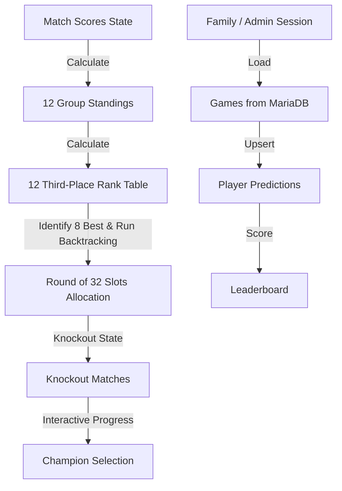

# Technical Plan: World Cup 2026 Simulator

## 1. Architecture Overview
This is a Single Page React Application built with Vite. It maintains four main tabs/views:
1. **Predictions View**: Family and friends log in with a shared password (or a passwordless `/invite/<token>` link), predict the exact score of real World Cup 2026 games, and see a live leaderboard. Admin tools live on a dedicated `/admin` page.
2. **Group Stage View**: Displays 12 groups, their current standing tables, and lists of matches with score inputs. Users can manually enter scores, simulate individual groups, or simulate all groups at once.
3. **Third-Place Standings View**: Calculates the 12 third-placed teams' records, ranks them, highlights the top 8, and displays this table for transparency.
4. **Knockout Stage View**: Renders the 32-team bracket. Displays the Round of 32, Round of 16, Quarterfinals, Semifinals, Third-Place Match, and Final. Users can click on a team to advance them, or enter scores. If the winner is changed, all subsequent dependent matches in the bracket are cleared.

### Backend Overview (Predictions)
The predictions feature is backed by a small PHP + MariaDB service:
- `public/api/*.php` — public endpoints for login, games, leaderboard, saving predictions, and session state (`me.php`).
- `public/api/admin/*.php` — admin-only endpoints for results, game management, passwords, invite links, player management, and FIFA results sync.
- `db/schema.sql` — database schema for `games`, `predictions`, `players`, `config`, and `sync_log`.
- `db/seed.sql` — seed data with the 72 group-stage matches.
- One-time setup and cron configuration are documented in `db/SETUP.md`.

### State Flow


## 2. Data Models & Constants

### Team Object
```typescript
interface Team {
  id: string;      // e.g. "mex"
  name: string;    // e.g. "Mexico"
  code: string;    // e.g. "MEX"
  flag: string;    // Emoji flag e.g. "🇲🇽"
  group: string;   // "A" through "L"
  rating: number;  // 70 to 95 for simulation weight
}
```

### Match Object
```typescript
interface Match {
  id: string;          // e.g. "A1", "R32_1"
  type: 'group' | 'knockout';
  home: string;        // Team ID or placeholder like "1A", "3A/B/C/D/F"
  away: string;        // Team ID or placeholder
  homeScore: number | null;
  awayScore: number | null;
  group?: string;      // "A" through "L" if group match
  stage?: 'R32' | 'R16' | 'QF' | 'SF' | '3RD' | 'FINAL';
  nextMatchId?: string; // ID of the match the winner advances to
  winner?: string;     // Advanced team ID (for knockouts)
}
```

### Standings Object
```typescript
interface Standing {
  teamId: string;
  played: number;
  won: number;
  drawn: number;
  lost: number;
  gf: number;       // Goals For
  ga: number;       // Goals Against
  gd: number;       // Goal Difference
  points: number;
}
```

### Prediction Game Object
```typescript
interface PredictionGame {
  id: number;
  external_id: string;
  stage: string;
  group_letter: string | null;
  home_team_id: string | null;
  away_team_id: string | null;
  home_team_name: string;
  away_team_name: string;
  home_code: string | null;
  away_code: string | null;
  home_flag: string | null;
  away_flag: string | null;
  kickoff_utc: string;       // 'YYYY-MM-DD HH:MM:SS' in UTC
  venue: string | null;
  is_open: boolean;
  started: boolean;
  result_home: number | null;
  result_away: number | null;
  my_prediction: MyPrediction | null;
  predictions: RevealedPrediction[] | null; // present only once kickoff has passed
}
```

### Leaderboard Row Object
```typescript
interface LeaderboardRow {
  player_name: string;
  total: number;       // total points
  predictions: number; // number of predictions made
  games_scored: number;
}
```

## 3. Core Algorithms

### 1. Group Standings Calculation
For each group:
- Start with empty standings for the 4 teams.
- Loop through the 6 matches of the group.
- If both `homeScore` and `awayScore` are non-null:
  - Increment `played` for both.
  - Add goals to `gf` and `ga`.
  - Update `won`, `drawn`, `lost` and `points` (+3 for win, +1 for draw).
- Sort the standing rows using:
  1. Points (descending)
  2. Goal Difference (descending)
  3. Goals For (descending)
  4. Head-to-Head result (if exactly 2 teams are tied; otherwise fallback to team rating or alphabetical)

### 2. Best Third-Place Calculation
- Gather the 3rd placed team from each of the 12 groups.
- Rank them in a single table using:
  1. Points (descending)
  2. Goal Difference (descending)
  3. Goals For (descending)
  4. Rating/Rank (descending) as fallback
- The top 8 teams qualify.

### 3. Knockout Slot Allocation (Annex C Solver)
- Given the 8 qualifying third-place groups:
- Use a backtracking search to match the 8 qualified groups to the 8 group winner slots (`A`, `B`, `D`, `E`, `G`, `I`, `K`, `L`) such that:
  - Each group winner slot gets a third-place group that is listed in their official allowed combinations list.
  - No group winner faces a team from their own group.
- Once matched, populate the corresponding Round of 32 match slots.

### 4. Prediction Scoring
- For each finished game with an official result:
  - Exact score predicted → 3 points (`points_exact`).
  - Correct winner/draw (but not exact score) → 1 point (`points_result`).
  - Wrong result → 0 points.
- Points are configurable in the `config` table and applied when an admin saves a result or the auto-sync runs.

### 5. Admin & Auto-Sync Workflows
- **Admin result entry**: Admin selects a started game on `/admin`, enters the final score, and the backend updates `games.result_*` and re-scores all related predictions.
- **Add/edit game**: Admin provides stage, teams, kick-off (local time converted to UTC), and optional metadata; the game becomes available for predictions immediately.
- **Invite links**: Admin can generate, disable, or regenerate a passwordless `/invite/<token>` link for easy family onboarding.
- **Player management**: Admin can remove a player and all their predictions from the pool.
- **Passwords**: Separate shared (family) and admin passwords, set via the one-time `api/setup.php` page and rotatable in `/admin`.
- **FIFA auto-sync**: `api/admin/sync_results.php` fetches finished WC2026 games from FIFA's JSON feed, matches them by team code, fills missing results, re-scores predictions, and logs actions. Intended to run once or twice daily via cron.

## 4. Risks & Mitigations
- **Complexity of bracket state reset**: If a user changes a score in the group stage or early knockout stages, we must clear the downstream winner chain.
  *Mitigation*: Implement a dependency clearing function that resets the `home`/`away` and `winner` of downstream matches recursively.
- **Large screen vs mobile size**: The bracket can be very wide.
  *Mitigation*: Implement a swipeable layout or view toggle (e.g. view Round of 32, view Round of 16, etc.) on mobile devices so it remains clean and easy to navigate.
- **Backend dependency for predictions**: The Predictions tab requires a running PHP + MariaDB backend; without it, the tab cannot load real data.
  *Mitigation*: Provide a `VITE_PRED_MOCK=true` environment variable so developers can run the UI with mock data without a backend.
- **Time-based prediction locks**: The server clock decides when a game is "started" and locks predictions; incorrect server time could lock users out early.
  *Mitigation*: Store kick-off times in UTC, display them in the user's local timezone, and document the need to verify server time in `db/SETUP.md`.
- **Invite link abuse**: A leaked invite link could let non-family members join the pool.
  *Mitigation*: Invite links can be disabled or regenerated from the `/admin` page at any time.
