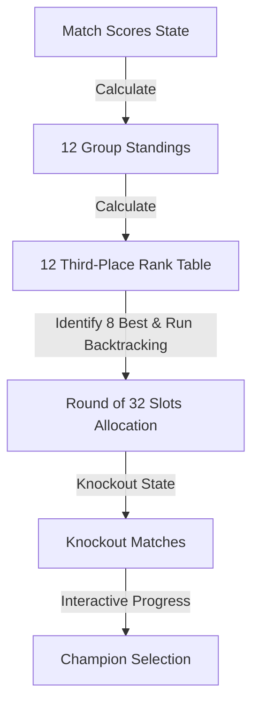

# Technical Plan: World Cup 2026 Simulator

## 1. Architecture Overview
This is a Single Page React Application built with Vite. It maintains three main pages/views:
1. **Group Stage View**: Displays 12 groups, their current standing tables, and lists of matches with score inputs. Users can manually enter scores, simulate individual groups, or simulate all groups at once.
2. **Third-Place Standings View**: Calculates the 12 third-placed teams' records, ranks them, highlights the top 8, and displays this table for transparency.
3. **Knockout Stage View**: Renders the 32-team bracket. Displays the Round of 32, Round of 16, Quarterfinals, Semifinals, Third-Place Match, and Final. Users can click on a team to advance them, or enter scores. If the winner is changed, all subsequent dependent matches in the bracket are cleared.

### State Flow


## 2. Data Models & Constants

### Team Object
```typescript
interface Team {
  id: string;      // e.g. "mex"
  name: string;    // e.g. "Mexico"
  code: string;    // e.g. "MEX"
  flag: string;    // Emoji flag e.g. "🇲🇽"
  group: string;   // "A" through "L"
  rating: number;  // 70 to 95 for simulation weight
}
```

### Match Object
```typescript
interface Match {
  id: string;          // e.g. "A1", "R32_1"
  type: 'group' | 'knockout';
  home: string;        // Team ID or placeholder like "1A", "3A/B/C/D/F"
  away: string;        // Team ID or placeholder
  homeScore: number | null;
  awayScore: number | null;
  group?: string;      // "A" through "L" if group match
  stage?: 'R32' | 'R16' | 'QF' | 'SF' | '3RD' | 'FINAL';
  nextMatchId?: string; // ID of the match the winner advances to
  winner?: string;     // Advanced team ID (for knockouts)
}
```

### Standings Object
```typescript
interface Standing {
  teamId: string;
  played: number;
  won: number;
  drawn: number;
  lost: number;
  gf: number;       // Goals For
  ga: number;       // Goals Against
  gd: number;       // Goal Difference
  points: number;
}
```

## 3. Core Algorithms

### 1. Group Standings Calculation
For each group:
- Start with empty standings for the 4 teams.
- Loop through the 6 matches of the group.
- If both `homeScore` and `awayScore` are non-null:
  - Increment `played` for both.
  - Add goals to `gf` and `ga`.
  - Update `won`, `drawn`, `lost` and `points` (+3 for win, +1 for draw).
- Sort the standing rows using:
  1. Points (descending)
  2. Goal Difference (descending)
  3. Goals For (descending)
  4. Head-to-Head result (if exactly 2 teams are tied; otherwise fallback to team rating or alphabetical)

### 2. Best Third-Place Calculation
- Gather the 3rd placed team from each of the 12 groups.
- Rank them in a single table using:
  1. Points (descending)
  2. Goal Difference (descending)
  3. Goals For (descending)
  4. Rating/Rank (descending) as fallback
- The top 8 teams qualify.

### 3. Knockout Slot Allocation (Annex C Solver)
- Given the 8 qualifying third-place groups:
- Use a backtracking search to match the 8 qualified groups to the 8 group winner slots (`A`, `B`, `D`, `E`, `G`, `I`, `K`, `L`) such that:
  - Each group winner slot gets a third-place group that is listed in their official allowed combinations list.
  - No group winner faces a team from their own group.
- Once matched, populate the corresponding Round of 32 match slots.

## 4. Risks & Mitigations
- **Complexity of bracket state reset**: If a user changes a score in the group stage or early knockout stages, we must clear the downstream winner chain.
  *Mitigation*: Implement a dependency clearing function that resets the `home`/`away` and `winner` of downstream matches recursively.
- **Large screen vs mobile size**: The bracket can be very wide.
  *Mitigation*: Implement a swipeable layout or view toggle (e.g. view Round of 32, view Round of 16, etc.) on mobile devices so it remains clean and easy to navigate.
